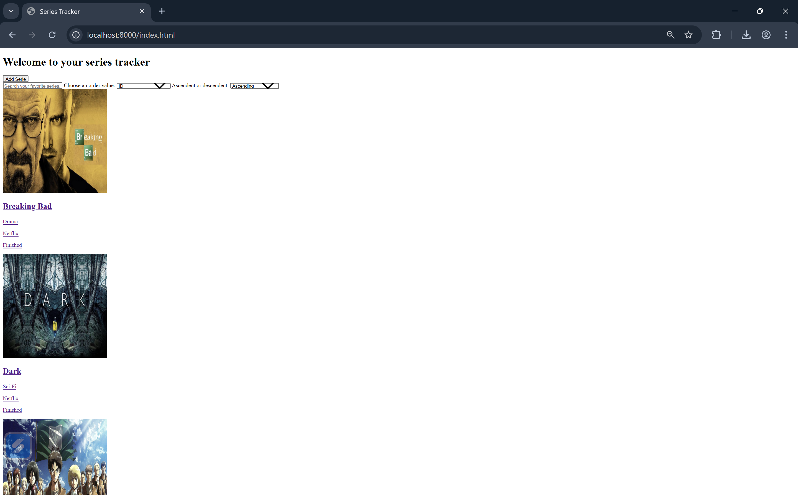

# Series Tracker - Frontend

Cliente JavaScript vanilla para la API REST de Series Tracker. Construido con HTML, CSS y JavaScript puro — sin frameworks ni librerías externas.

---

## 🔗 Repositorios

- **Backend:** https://github.com/jdivass/Proyecto1-Web-Backend.git
- **FrontEnd:** https://github.com/jdivass/Proyecto1-Web_Frontend.git

---

## 🚀 Deployment en Vercel

https://proyecto1-web-frontend-henna.vercel.app/

---

## 🛠️ Tecnologías usadas

- HTML5
- CSS3
- JavaScript vanilla (fetch API)
- Sin frameworks, sin librerías externas

---

## 📁 Estructura del proyecto
```
frontend/
├── index.html        # Página principal — lista todas las series
├── serie.html        # Página de detalle de una serie
├── form.html         # Formulario para crear y editar series
├── api.js            # Todas las llamadas a la API (fetch)
├── index.js          # Lógica de la página principal
├── serie.js          # Lógica de la página de detalle
├── form.js           # Lógica del formulario
└── styles.css        # Estilos globales
```

## ⚙️ Instalación y ejecución

### 1. Clonar repositorio

```bash
git clone https://github.com/jdivass/Proyecto1-Web_Frontend.git
cd Proyecto1-Web_Frontend
```

### 2. Asegurarse de que el backend esté corriendo
```
http://localhost:8080/
```

### 3. Actualizar el API_URL en api.js

```javascript
const API_URL = "http://localhost:8080";
```

### 4. Levantar un servidor local

```bash
cd tu-repo-frontend
python3 -m http.server 
```

Luego abre en el navegador:

http://localhost:8000

### 5. Abrir index.html en el navegador

No se necesita ningún build ni servidor adicional.

---

## 📌 Funcionalidades

- Ver todas las series con paginación, búsqueda y ordenamiento
- Ver el detalle de una serie con su rating incluido
- Crear, editar y eliminar series con subida de imagen
- Crear, editar y eliminar ratings con sistema de estrellas

---

## 🌐 CORS

CORS (Cross-Origin Resource Sharing) es una política de seguridad del navegador que bloquea peticiones entre orígenes distintos — por ejemplo, entre el frontend en el puerto 3000 y el backend en el puerto 8080. El backend está configurado para permitirlas explícitamente con el header Access-Control-Allow-Origin: *.

---

## 🔐 Aplicación funcionando



---

## 🎯 Challenges implementados

### Criterios subjetivos
| Challenge | Puntos |
| -------- | -------- |
| Calidad del historial de Git | 0 - 20 |
| Organización del código | 0 - 20 |

### Frontend
| Challenge | Puntos |
| -------- | -------- |
| Paginación con ?page= y ?limit= | 30 |
| Búsqueda por título con ?q= | 15 |
| Ordenamiento con ?sort= y ?order= | 15 |
| Sistema de rating visible en el cliente | 30 |
| Subida de imágenes | 30 |
| Total | 160 |

---

## 💡 Reflexión

Al hacer uso de CSS, HTML5, CSS3 y JavaScript vanilla se nota mucho cómo los frameworks de desarrollo web facilitan y aceleran mucho el proceso. Al usar solamente herramientas básicas resulta mucho más laborioso realizar todos los cambios y dinámicas en la página al tener que buscar directamente por id, definir una estructura HTML paso por paso y demás. Sin embargo, considero que los laboratorios y ejercicios anteriores facilitaron el proceso.

Respecto a los challenges, si bien la lógica se manejo en el backend también fue necesario diseñar para esa lógica en el front end. Considero que son challenges muy prácticos que enseñan features a implementar en aplicaciones del día a día, por lo que los considero muy valiosos para el aprendizaje.

Creo que haría nuevamente un proyecto solo con HTML, CSS y JavaScript solamente para volver a practicar estas "bases" del desarrollo web y recordar la importancia de los frameworks.

---

## 👨‍💻 Autor

Julián Divas

Frontend desarrollado en JavaScript vanilla para proyecto de Series Tracker

Repositorio: https://github.com/tu-usuario/tu-repo-frontend.git